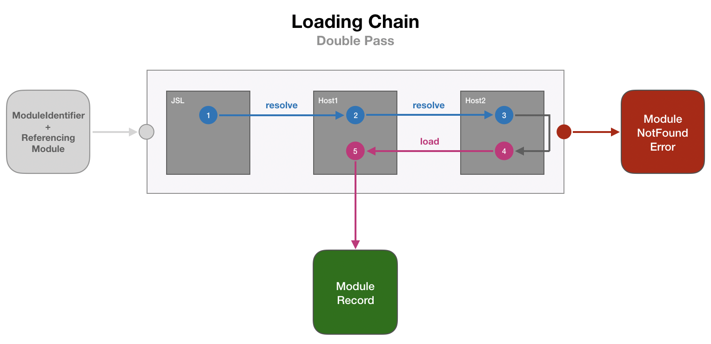

# JavaScript Standard Library Proposal

Proposal for adding a mechanism for enabling a more extensive standard library in JavaScript. With
this infrastructure in place it will be possible to start iterating on standard
library features as modules in the future.

<details>
  <summary><strong>Table of Contents</strong></summary>

  * [Scope](#scope)
  * [Motivation](#motivation)
  * [Proposed Solution](#proposed-solution)
  * [Import Semantics](#import-semantics)
  * [Module Resolution](#module-resolution)
  * [Related Efforts](#related-efforts)

</details>

## Scope

The goal of this proposal is to define a mechanism for enabling a more extensive standard library in
JavaScript than is currently available. This proposal would not change the behavior of any existing code or
add any new syntax, except possibly the syntax for importing the standard library code.

The contents of the standard library is tangential to this proposal, and would be built and expanded upon in
later efforts. Such a library would only cover features which would be useful in JavaScript in general, not
things which are tied to the web platform. (A good heuristic: if something would make sense on a web browser
but not in node or on [embedded devices](https://www.moddable.com/) or [robots](http://johnny-five.io/), it
probably isn't in scope.) See [#16](https://github.com/tc39/proposal-javascript-standard-library/issues/16)
for discussion of the extent and contents of the library.


## Motivation

Most programming languages have core language features (syntax, operators, primitives etc.) and also
include a standard library with common functionality. Developers are able to use this in their programs
immediately because the library is bundled with the runtime.

The JavaScript language does not have a standard library resulting in common functionality being developed
into libraries that are included with JavaScript programs. Because these libraries need to be included in every
program instead of being provided by the runtime these programs are bigger with users paying the cost of
downloading and parsing the extra bits. These libraries are also harder to cache between programs.

JavaScript programs run on a variety of clients with different runtime implementations and versions. Libraries
have to account for these different environments by including code that is not required or even run on some
clients, but does incur a download and parse cost.


## Proposed Solution

To enable developers to access common functionality at runtime that is provided by the JavaScript engine the
notion of a standard library has to be created. This will allow code currently loaded through libraries as
part of the program to shift towards being bundled with JavaScript implementations in the future.

> Disclaimer: This proposal covers adding a mechanism for enabling a standard library in JavaScript
> implementations, it does not describe its contents. This is considered a tangential effort that would
> be built and expanded upon in the future when a mechanism for accessing it is in place.

Having a standard library readily available at runtime means programs won't have to include the functionality
availabile in the standard library, reducing the download and parse cost of the program. The functionality
will also be standardized across implementations giving the developer guarentees about quality, behavior and
speed.

Although JavaScript engines already have the notion of built-ins, the standard library will use modules and
the `import` syntax to access it. This mechanism should already be familiar to developers and will allow them
to opt-in to functionality they need. Using modules also allows more flexibility when designing the library
contents and helps avoiding conflicts with global APIs.

Modules for the standard library should be able to be written in plain JavaScript for the most part but for
hot pieces of code the engine could provide a native implementation.

## Import Semantics

To import modules from the standard library the engine has to be able to distinguish between standard library
modules and other (user defined) modules. To allow the engine to do this standard library modules should use a
prefix in the module identifier string. This is prefered over other alternatives because it is does not
introduce new syntax for loading standard library modules and stays close to the `import` statement developers
should already be familiar with.

### Namespace

The `js:` prefix will be reserved as the namespace for the JavaScript language only and will be governed by
TC39, making the standard library a true JavaScript standard library. This will allow the committee to work
safely within this namespace when designing and developing the standard library over time.

> Alternatives for distinguishing standard modules are documented in [Appendix
> A](#a-distinguishing-standard-library-modules).

By creating a namespaces specifically for the JavaScript standard library, developers will know what to expect
when importing from using the `js:` prefix across different implementations and can be assured the same
modules are available across these implementations (not considering implementation constraints, vendor
timelines or version differences).

It is completely feasable that more namespaces are introduced which are goverened by other standards bodies or
organizations.  However it is important that these namespaces stay independent of each other to avoid
conflicts, hamper development within namespaces due to outside pollution or time constraints due to
dependencies on other organizations.

The namespace used for the JavaScript standard library will be registered with IANA to prevent collisions in
the future. Any other organization introducing a namespace prefix would be encouraged to do the same.

### Freezing Exports

All exported objects and classes from the standard library will have their prototype frozen. This will prevent
prototypes from imported objects to be modified outside of the module causing prototype pollution.

In the past the committee had to make concessions to maintain web compatibility when adding new functionality
to built-in objects. By freezing the prototype of standard library exports, it will no longer be possible for 
third party code to modify or extending library code in a possibly incompatible way. This will allow for more
flexibility when designing and developing the standard library. Extending standard library classes and objects
can still be done using `extend` or `Object.create`.

We can start of by cenventionally enforcing `Object.freeze` on exported Objects from standard library modules.
If this turns out to be hard to check and enforce a separate proposal can be created to describe automatically
freezing prototypes at the module boudary for standard library modules.

## Module Resolution

To allow the JavaScript engine to participate in module resolution and loading the
**HostResolveModuleIdentifier** Abstract Operation should be changed to allow more than one resolver. The
resolvers are arranged in a chain and consulted by the engine one by one to resolve a requested
ModuleIdentifier. This mechanism is heavily inspired by [Pythons importing system for
modules](https://docs.python.org/3/reference/import.html).

The implementation of the chain will be hidden inside the engine and will provide the same guarantees
*HostResolveModuleIdentifier* currently does:

* It must return an instance of ModuleRecord
* It must throw an error if a ModuleRecord cannot be created
* It must be idempotent for pair of (ModuleIdentifier, ReferencingModule)

Importing is done in two phases: resolution and loading. Resolution is done through objects implementing the
_ResolveModuleIdentifier_ operation and loading is done through objects implementing the
_LoadModuleIdentifier_
operation. Objects implementing both operations are referred to as importers.



Multiple importers can be registered with the engine and will be appended to the chain. The engine will always
register the internal JavaScript Standard Library importer first to make sure it is at the front of the chain.

During the resolution step (phase 1) importers perform the _ResolveModuleIdentifier_ operation in order of
registration. This operation results in a _ModuleResolutionRecord_ that is passed along the chain and can be
used by subsequent importers.

After the resolution step the loading step (phase 2) is invoked. During this step the importers are visited in
reverse order to perform the _LoadModuleIdentifier_ operation to try and load the requested _ModuleIdentifier_.
The operation is passed the _ModuleResolutionRecords_ from the resolution step. When the _ModuleIdentifier_ can be
loaded a full _ModuleRecord_ is returned and the chain is exited immediately. When no _ModuleRecord_ is produced
the next importer is consulted until the chain is exhausted, resulting in a _ModuleNotFound_ error.

### Polyfilling

During the loading step (phase 2) the chain is traversed in reverse order to allow for higher ranked (e.g.
registered later) importers to override lower ranked importers. This will allow the host for example to
override standard library modules and achieve polyfilling.

There are three use cases that a polyfilling solution for the standard library should support:

  * Add missing parts of the standard library
  * Update incomplete implementations
  * Patch broken broken parts of the standard library

> Polyfilling is intended to cover these three use cases only.

For the web platform polyfilling could be done using the [Import Maps Proposal](https://github.com/domenic/import-maps).
A resolver registered by the embedder (a web browser in this case) could check the import map to see if a
standard library _ModuleIdentifier_ should be redirected to another implementation.


## Related Efforts

This subject has been talked about in the past and has related efforts:

- [https://github.com/tc39/ecma262/issues/395](https://github.com/tc39/ecma262/issues/395)
- [https://github.com/domenic/import-maps](https://github.com/domenic/import-maps)

## Frequently Asked Questions

> Coming Soon™

## Appendices

### A. Distinguishing Standard Library Modules

One of the requirements for the standard library is being able to distinguish when a module is user defined
and when it should be loaded from the standard library. There are a lot of approaches to doing this and this
section contains alternatives considered to the recommendation earlier in the proposal.

> Important: The code samples and modules used in the examples are purely for illustrative purposes

**Identifier Based**

When importing a module the _ModuleSpecifier_ is required to be a string. Interpreting the contents of the
string is currently left to the embedder effectively always making it a user defined module.

To circumnavigate this and preserving the current behavior a different _ModuleSpecifier_ form using a special
_Identifier_ could be used instead of a string literal:

```js
import { ... } from std.SomeStandardModule;
```

The `std` identifier is used to change the signature in a way that makes it possible for engines to detect
this is a module that should be loaded from the standard library. The downside of using `std.________` is that
it start to look like a global object that is also available in other contexts.

It could also be possible to use specialized tokens in place of _Identifier_ prefix, for example similar to
C/C++:

```js
import { ... } from <SomeStandardModule>;
```

While this makes importing standard library modules  distinctly different from user defined modules this is
also one of the downsides. The syntax is different from the import syntax developers should already be
familiar with and a dynamic variant would be difficult (gramar wise).

Not using a prefix also has the downside of requiring everything from the standard library to live in the same
space creating a new “global” namespace and preventing the use of multiple namespaces for different contexts.

> Reference: [tc39/ecma262#395-comment-371865432](https://github.com/tc39/ecma262/issues/395#issuecomment-371865432)

**Separate Keyword**

When importing a module the _ModuleSpecifier_ is required to be a string. Interpreting the contents of the
string is currently left to the embedder effectively always making it a user defined module.

To circumnavigate this and preserving the current behavior a different keyword from `import` could be
introduced specifically for importing modules from the standard library:

```js
include { ... } from <SomeStandardModule>;
```

> Important: The `include` keyword does not exist and is used for illustrative purposes only

The seperate keyword is emphasised by combining it with an Identifier for the _ModuleSpecifier_. The separate
keyword already distingishes the module enough so we can also safely use a string literal for the
_ModuleSpecifier_:

```js
include { ... } from "SomeStandardModule";
```

While this makes importing standard library modules very distinctly different from user defined modules this
is also one of its downsides. The syntax is different from the `import` syntax developers should already be
familiar with and a dynamic variant of the keyword would also have to be created.

Not using a prefix also has the downside of requiring everything from the standard library to live in the same
space creating a new “global” namespace and preventing the use of multiple namespaces for different contexts.

> Reference: [tc39/ecma262#395-comment-196917747](https://github.com/tc39/ecma262/issues/395#issuecomment-196917747)

**URL Based**

There is already support for importing modules from a URL in browsers like Safari using `import`
statements inside of a `<script type="module" ... />`. The host portion of the URL could be used as a prefix
for distinguishing standard library modules and fits very natural within the concept of URLs:

```js
import { ... } from "https://www.ecma-international.com/ecmascript/SomeStandardModule";
```

Using a URL with a domain for importing modules does not always make sense outside of a web context, for
example in Node.js or embedded devices. It also requires ownership of the domain over a long period of time.
A transfer of the domain might make the prefix useless or exclude a number of modules from being imported.

> Reference: [tc39/ecma262#395-comment-328528910](https://github.com/tc39/ecma262/issues/395#issuecomment-328528910)

**NPM Style**

The Node Package Manager (NPM for short) has an established format for importing packages published to a
central registry. The format allows packages to be grouped under organizations and this could be leveraged as
a prefix for the JavaScript standard library:

```js
import { ... } from "@std/SomeStandardModule";
```

While this format makes sense in environments where NPM is already used it is not as universal as a URL. The
NPM style format also suffers some of the same downsides as a [**URL Based**](#url-based) approach.

This format would require ownership over the organization on NPM (https://npmjs.com) and keeping multiple
namespaces in mind would require all to do the same. But NPM is only the most commonly used registry, there
might be other registries, possibly private ones that would be impossible to get ownership over a
namespace. Using this format could exclude modules from being imported.

The biggest downside utilizing this format is standard library modules looking the same as user defined
modules which might cause confusion, for example where modules come from in a Node.js/NPM context. The two
modules behave different and the same assumptions can't be applied to both.

> Reference: [tc39/proposal-javascript-standard-library#16-comment-]()

### B. Federated or Shared Namespace

> Coming Soon™

## Specification

- [Ecmarkup source](https://github.com/tc39/proposal-javascript-standard-library/blob/master/spec.html)
- [HTML version](https://tc39.github.io/proposal-javascript-standard-library/)

## Implementations

- none yet

